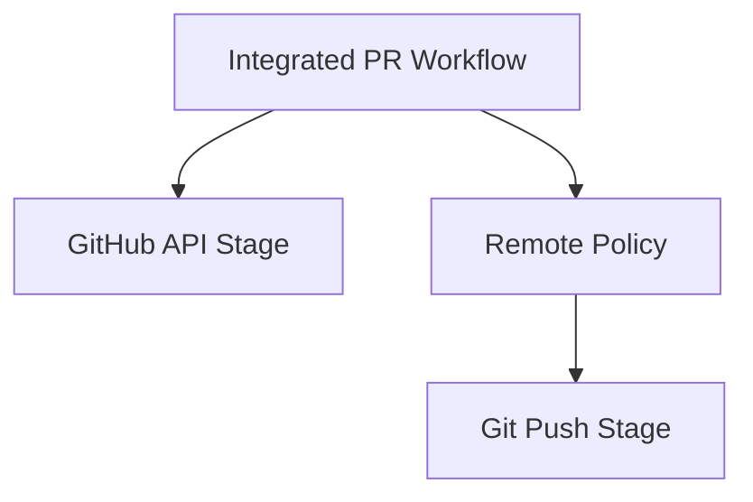

# ADR-001: Fork Remote Policy for Integrated PR Workflows

**Date:** 2026-03-14
**Status:** APPROVED
**Deciders:** Project maintainers, product owner, implementation planning owner
**Technical Story:** Linux SSH Git auth parent capability, C3 SSH-Compatible Fork Remote Handling

---

## Context and Problem Statement

The current integrated PR workflows are mixed-capability flows. They use GitHub APIs to read the current user, detect or create a fork, and create the PR, but they also perform a local `git push` as part of the same workflow. Repository evidence shows that the current code rewrites the push remote to HTTPS before that push stage. That behavior is acceptable for a credential-helper-driven HTTPS path, but it directly conflicts with the Linux SSH feature target because it breaks the normal contribution path for users whose working Git transport is SSH-based.

This is not the same decision as "should GitHub auth and transport auth be separate?" That boundary is already settled. The decision here is narrower and architectural: when the integrated PR workflow needs to choose or prepare a push remote, should it only preserve SSH if the remote is already SSH-compatible, or should it also construct/select an SSH-compatible fork remote when the workflow creates or uses a fork? This is a distinct policy surface from stage attribution, which is why the capability refactor split it into C3.

### Requirements
- [x] Integrated PR workflows must stop forcing SSH-compatible push paths back to HTTPS.
- [x] Fork-based contribution must remain viable in the normal integrated PR flow, not only in manually preconfigured repositories.
- [x] Remote policy failures must surface as remote/protocol issues rather than silently falling back to HTTPS.
- [x] Existing supported HTTPS workflows must remain non-regressed.

---

## Decision Drivers

1. **Normal contribution path must work on Linux without GCM** - The feature target was explicitly resolved to include the integrated PR workflows, not only transport-only update flows.
2. **Remote protocol policy is separate from auth policy** - GitHub API auth can remain required for fork/PR work while the push stage still uses SSH-compatible transport.
3. **Silent HTTPS fallback would preserve the current failure mode** - Preserve-only behavior leaves app-created fork flows dependent on HTTPS unless the user manually fixes remotes outside the app.
4. **HTTPS users cannot be broken** - The decision must allow supported HTTPS workflows to remain valid.

---

## Considered Options

### Option 1: Preserve SSH only when an existing remote is already SSH-compatible
**Description:** If `origin` or `fork` is already SSH-compatible, keep it. If not, continue using HTTPS for new or app-created fork remotes.

**Pros:**
- ✅ Smaller behavior change from the current implementation.
- ✅ Lower immediate remote-construction complexity.
- ✅ Easier to preserve current HTTPS behavior for existing users.

**Cons:**
- ❌ Leaves the app-created fork path on HTTPS, which is part of the current Linux friction.
- ❌ Makes successful Linux SSH contribution depend on external manual remote preparation.
- ❌ Creates an inconsistent policy surface between "already SSH" and "app-created fork."

**Estimated Effort:** Medium
**Risk Level:** High

### Option 2: Preserve existing SSH-compatible remotes and construct/select SSH-compatible fork remotes by default for the integrated PR path
**Description:** Keep SSH-compatible existing remotes when present. When the workflow creates or selects a fork remote for push, make that remote SSH-compatible according to the app's approved policy instead of forcing HTTPS.

**Pros:**
- ✅ Fixes the normal Linux contribution path instead of only preserving manual setup.
- ✅ Keeps remote policy aligned with the SSH transport goal across both existing and app-created fork scenarios.
- ✅ Avoids silent protocol switching inside the mixed PR workflows.

**Cons:**
- ❌ Requires explicit remote-construction policy and more careful validation.
- ❌ Increases implementation planning scope for fork-path handling.
- ❌ Requires stronger regression coverage against HTTPS workflows.

**Estimated Effort:** Medium
**Risk Level:** Medium

### Option 3: Keep HTTPS remotes in-app and document terminal-based SSH setup as a user workaround
**Description:** Leave the app's PR remote policy HTTPS-based and treat SSH as an out-of-app or advanced-user path.

**Pros:**
- ✅ Lowest implementation churn.
- ✅ Minimal change to current remote-handling code.
- ✅ No new fork-remote policy required.

**Cons:**
- ❌ Fails the resolved feature target for Linux normal contribution.
- ❌ Preserves current dependence on credential-helper-oriented behavior.
- ❌ Conflicts with the approved transport/API separation goal.

**Estimated Effort:** Small
**Risk Level:** High

---

## Decision Outcome

### Chosen Option: Option 2 - Preserve existing SSH-compatible remotes and construct/select SSH-compatible fork remotes by default

**Justification:**

Option 2 is the only option that aligns the integrated PR workflows with the stated feature outcome. Option 1 would improve only the already-manually-configured case and would leave the app-created fork path on the same HTTPS transport model that currently causes Linux friction. Option 3 is effectively a rejection of the normal-contribution fix. The proposed direction therefore is:

- preserve an SSH-compatible existing push remote when one is already present;
- when the workflow must create or select a fork remote for push, make that remote SSH-compatible by policy rather than forcing HTTPS;
- treat remote-policy failure as a protocol/remote issue, not as a GitHub-auth failure;
- keep HTTPS workflows supported where they are already valid.

This ADR remains `PROPOSED` because the exact remote-construction details still belong to implementation planning, but the policy direction is decision-ready now.

### Implementation Plan
1. Confirm the exact SSH remote form to use for app-created fork remotes.
2. Update the PR workflow plan so remote preparation follows this policy before push.
3. Add validation coverage for existing SSH remotes, newly created fork remotes, and HTTPS non-regression.
4. Reconfirm policy after implementation spikes if remote-host or repository edge cases emerge.

---

## Consequences

### Positive Consequences
- ✅ The integrated PR path can satisfy the Linux SSH contribution target end to end.
- ✅ Remote protocol behavior becomes consistent between existing-remotes and app-created fork flows.
- ✅ The decision keeps remote policy separate from GitHub API auth policy.

### Negative Consequences
- ⚠️ Remote-construction behavior becomes part of the app's explicit product contract.
- ⚠️ Fork-path validation becomes more important and more varied.
- ⚠️ HTTPS compatibility must be tested as a release gate, not assumed.

### Risks and Mitigations
| Risk | Probability | Impact | Mitigation Strategy |
|------|-------------|--------|---------------------|
| App-created fork remote shape is wrong for some GitHub cases | Med | High | Validate against the primary upstream-owner and fork-user scenarios before implementation is accepted |
| HTTPS workflows regress while remote policy changes | Med | High | Keep HTTPS as an explicit non-regression gate in the RTM and validation plan |
| Remote-protocol failure still surfaces as generic auth failure | Med | High | Require remote-policy-specific error reporting in the PR workflow plan |

---

## Technical Details

### Architecture Diagram

### Key Design Decisions
- **Remote preservation comes before push:** the workflow must prepare the push remote according to policy before local `git push`.
- **Fork remote policy is distinct from API auth:** GitHub APIs may still create or detect forks, but that does not decide transport protocol.
- **No silent HTTPS fallback in SSH-capable PR paths:** protocol mismatch should surface explicitly.

### Performance Implications
- Negligible runtime cost relative to current PR workflows.
- Slightly higher validation cost due to more remote-path variants.

### Security Considerations
- Preserves the existing intent not to store or expose credential-bearing remotes.
- Keeps local transport credentials in the user's SSH environment rather than inside the app.
- Avoids conflating GitHub OAuth with transport credential ownership.

---

## Compliance and Standards

- [x] Follows the approved transport-vs-GitHub-auth boundary from the design doc.
- [x] Aligns with the capability split for C3 in the proposal refactor.
- [x] Preserves the cross-cutting HTTPS non-regression requirement.
- [x] Supports RTM requirements `LSGA-C3-001` through `LSGA-C3-003`.

---

## References and Prior Art

- [`docs/reports/02_phase1-linux-ssh-git-auth-foundation-report.md`](../reports/02_phase1-linux-ssh-git-auth-foundation-report.md)
- [`docs/reports/03_linux-ssh-git-auth-proposal-refactor.md`](../reports/03_linux-ssh-git-auth-proposal-refactor.md)
- [`docs/architecture/requirements-traceability-matrix.md`](./requirements-traceability-matrix.md)
- [`Views/GitTabView.axaml.cs`](../../Views/GitTabView.axaml.cs)

---

## Review and Approval

| Reviewer | Role | Date | Status |
|----------|------|------|--------|
| TBD | Maintainer | | Pending |
| TBD | Product | | Pending |
| TBD | Implementation planner | | Pending |

---

## Future Considerations

### Revisit Criteria
This decision should be revisited when:
- [ ] The product expands clone into an SSH-capable in-app path
- [ ] GitHub host or remote requirements force a different fork-remote policy
- [ ] HTTPS compatibility constraints require a different default behavior

### Migration Path
If we need to change this decision:
1. Isolate remote-policy logic behind a single PR-workflow decision point.
2. Add explicit migration tests for both SSH and HTTPS fork paths.
3. Reissue or supersede this ADR with the revised policy.
