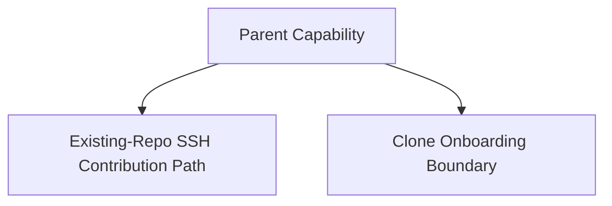

# ADR-004: Clone Scope Boundary for Initial Linux SSH Release

**Date:** 2026-03-14
**Status:** APPROVED
**Deciders:** Project maintainers, product owner, implementation planning owner
**Technical Story:** Linux SSH Git auth parent capability, deferred clone boundary

---

## Context and Problem Statement

Phase 1 established that clone is a special case in the current product. The Git tab hardcodes clone to an HTTPS URL and does not preserve or inspect an existing remote, because clone is the onboarding path that creates the initial repository state. The proposal refactor therefore rejected clone as a child capability in the current parent/child model and treated it as a parent-level scope boundary instead.

The question is whether clone should remain explicitly out of scope for the initial Linux SSH release or whether SSH-capable clone handling should be added now. This is not a child-capability architecture decision for the current implementation slice; it is a scope-boundary decision that affects whether the current work stays focused on the normal contribution path or expands into onboarding behavior.

### Requirements
- [x] The initial Linux SSH release must fix the normal contribution path on Linux.
- [x] Clone scope must not block implementation planning for the in-scope child capabilities.
- [x] If clone stays deferred, the boundary must be explicit rather than implicit.
- [x] The decision must preserve existing HTTPS onboarding if clone is not expanded now.

---

## Decision Drivers

1. **Normal contribution is the resolved target** - The main PR workflows are in scope and already consume most of the meaningful SSH behavior change.
2. **Clone is behaviorally separate** - It is onboarding, not existing-repo contribution.
3. **Scope control matters** - Adding SSH-capable clone now increases scope without being required to unblock the main contribution path.
4. **The current clone path already has a stable HTTPS behavior** - That can remain valid while the SSH contribution path is improved.

---

## Considered Options

### Option 1: Keep clone out of scope for the initial release and preserve it as an HTTPS-only onboarding path
**Description:** Leave integrated clone behavior unchanged for the initial release while making the existing-repo SSH contribution path work end to end.

**Pros:**
- ✅ Keeps the release focused on the normal contribution path that Phase 1 resolved as the primary target.
- ✅ Avoids mixing onboarding changes into the core SSH transport/auth work.
- ✅ Preserves current clone behavior for users who rely on it.

**Cons:**
- ❌ Users cannot start a new repo via SSH inside the app in the initial release.
- ❌ The parent capability remains broader than the first in-scope implementation slice.
- ❌ A later follow-on decision may still be needed if SSH clone becomes desirable.

**Estimated Effort:** Small
**Risk Level:** Low

### Option 2: Add SSH-capable clone handling in the current release
**Description:** Expand the initial Linux SSH work to include SSH-aware clone behavior and remote selection.

**Pros:**
- ✅ More complete SSH story in one release.
- ✅ Reduces the difference between onboarding and existing-repo contribution behavior.
- ✅ Avoids a later follow-on clone decision if implemented well.

**Cons:**
- ❌ Expands scope beyond what is required to fix the normal contribution path.
- ❌ Introduces new onboarding and remote-selection behavior into the same release.
- ❌ Requires more design and validation work than current evidence justifies.

**Estimated Effort:** Medium
**Risk Level:** Medium

### Option 3: Remove or de-emphasize in-app clone while the SSH work is underway
**Description:** Treat clone as an external prerequisite and reduce emphasis on the in-app clone path.

**Pros:**
- ✅ Avoids mixed clone-policy decisions in the current release.
- ✅ Simplifies the SSH work to existing repos only.
- ✅ Eliminates some onboarding ambiguity.

**Cons:**
- ❌ Regresses or complicates existing onboarding value.
- ❌ Introduces unnecessary product churn unrelated to the SSH target.
- ❌ Solves the wrong problem.

**Estimated Effort:** Small
**Risk Level:** High

---

## Decision Outcome

### Chosen Option: Option 1 - Keep clone out of scope for the initial release

**Justification:**

Option 1 follows directly from the Phase 1 findings and the capability refactor. The initial Linux SSH release is supposed to fix the normal contribution path, and that path runs through existing-repo work plus the integrated PR workflows. Clone is a separate onboarding boundary that is currently HTTPS-only and does not need to change in order to unblock implementation planning for the in-scope child capabilities. Option 2 may be valuable later, but it expands scope now without being required for the primary target. Option 3 is unnecessary product churn.

The proposed scope boundary is:

- initial-release Linux SSH work includes existing-repo transport actions and integrated PR workflows;
- integrated clone remains unchanged as an HTTPS-only onboarding path for this release;
- clone may be promoted into a separate future child capability if product later chooses SSH-capable onboarding.

### Implementation Plan
1. Record clone as explicitly deferred in implementation planning.
2. Keep clone out of the current child-capability RTM except as a scope note.
3. Preserve current HTTPS clone behavior as a non-regressed onboarding path.
4. Revisit only if product later promotes SSH-capable clone into separate work.

---

## Consequences

### Positive Consequences
- ✅ Keeps the release aligned to the resolved feature target.
- ✅ Prevents onboarding scope from delaying the main Linux SSH contribution fix.
- ✅ Preserves current in-app clone behavior for existing users.

### Negative Consequences
- ⚠️ The initial release will not provide an end-to-end SSH onboarding story inside the app.
- ⚠️ Product messaging must make the clone boundary explicit if users ask about it.
- ⚠️ A later ADR may still be needed if clone is promoted into separate work.

### Risks and Mitigations
| Risk | Probability | Impact | Mitigation Strategy |
|------|-------------|--------|---------------------|
| Clone is assumed to be covered implicitly by the parent capability | Med | Med | State the boundary explicitly in implementation planning and release notes |
| Later work on SSH clone is harder because it was deferred | Low | Med | Keep clone documented as a deferred boundary rather than ignoring it |
| Users interpret HTTPS clone retention as a contradiction | Med | Low | Explain that clone is an onboarding boundary while the initial release targets normal contribution workflows |

---

## Technical Details

### Architecture Diagram

### Key Design Decisions
- **Clone is a scope boundary, not a child capability in this release.**
- **Existing HTTPS clone behavior remains valid for onboarding.**
- **Implementation planning proceeds without waiting for clone redesign.**

### Performance Implications
- No runtime impact from the decision itself.
- Lower planning and validation scope for the initial release.

### Security Considerations
- Leaves current onboarding auth behavior unchanged for this release.
- Avoids introducing new remote-selection or SSH-onboarding logic without dedicated design.
- Keeps the initial SSH work focused on transport/API separation in existing contribution flows.

---

## Compliance and Standards

- [x] Aligns with the proposal refactor decision to reject clone as a child capability for the current scope.
- [x] Preserves the resolved target that the initial release must include the integrated PR workflows.
- [x] Keeps current HTTPS onboarding behavior stable while SSH contribution behavior is improved.
- [x] Supports implementation planning by removing clone as a blocker for current scope.

---

## References and Prior Art

- [`docs/reports/02_phase1-linux-ssh-git-auth-foundation-report.md`](../reports/02_phase1-linux-ssh-git-auth-foundation-report.md)
- [`docs/reports/03_linux-ssh-git-auth-proposal-refactor.md`](../reports/03_linux-ssh-git-auth-proposal-refactor.md)
- [`docs/feature-proposals/01-linux-ssh-git-auth.md`](../feature-proposals/01-linux-ssh-git-auth.md)
- [`Views/GitTabView.axaml.cs`](../../Views/GitTabView.axaml.cs)

---

## Review and Approval

| Reviewer | Role | Date | Status |
|----------|------|------|--------|
| TBD | Maintainer | | Pending |
| TBD | Product | | Pending |
| TBD | Implementation planner | | Pending |

---

## Future Considerations

### Revisit Criteria
This decision should be revisited when:
- [ ] Product promotes SSH-capable clone into a separate scoped feature
- [ ] Onboarding friction becomes the primary Git-tab support problem
- [ ] The implementation of existing-repo SSH workflows reveals unavoidable clone dependencies

### Migration Path
If we need to change this decision:
1. Promote clone into its own scoped child capability.
2. Produce a dedicated design and RTM slice for SSH-capable clone behavior.
3. Supersede this ADR with the clone-specific scope decision.
